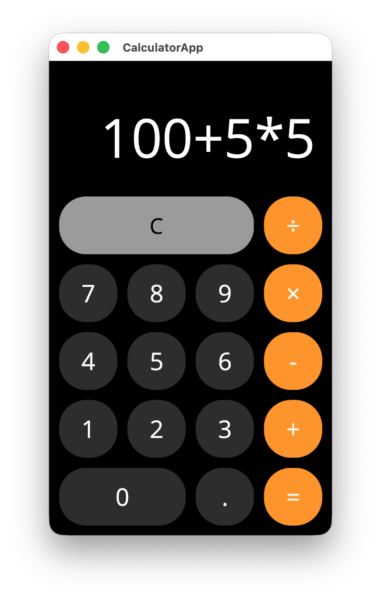

# MAUI Calculator App

.NET MAUI で構築されたシンプルな電卓アプリケーションです。
Antigravity の使い勝手の確認のために、Mac で MAUI を使ったアプリを作ってみました。

## 機能

- 基本的な四則演算（加算、減算、乗算、除算）
- 小数点計算のサポート（`decimal` 型による高精度計算）
- エラーハンドリング（0による除算など）
- 連続した演算子入力の適切な処理

## プロジェクト構成

- **CalculatorApp**: .NET MAUI アプリケーション（UI層）
- **CalculatorApp.Core**: アプリケーションロジック（ViewModelなど）
- **CalculatorApp.Tests**: 単体テストプロジェクト（xUnit）

## 必須要件

- .NET 10 SDK

## セットアップ

1. リポジトリをクローンします。
2. `Calculator.sln` を Visual Studio または VS Code で開きます。

## ビルドと実行

プロジェクトのルートディレクトリで以下のコマンドを実行します。

### Mac Catalyst (macOS) で実行する場合

```bash
dotnet build CalculatorApp -f net10.0-maccatalyst
dotnet run --project CalculatorApp -f net10.0-maccatalyst
```

### テストの実行

```bash
dotnet test
```

## スクリーンショット


